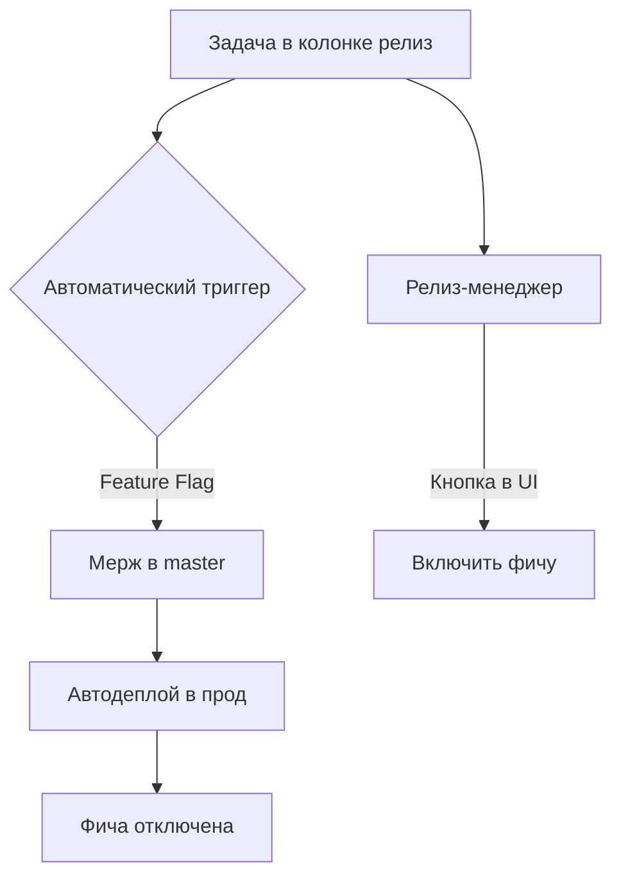

Ваш текущий процесс имеет серьезные недостатки в скорости доставки и качестве релизов. Вот анализ и рекомендации по оптимизации:

### Критические проблемы текущего подхода:
1. **Разрыв между master и продом**  
   Код в master ≠ коду в проде → высокий риск конфликтов при экстренных фиксах

2. **"Релизный долг"**  
   Накопление задач перед выкладкой → сложное тестирование, высокий риск багов

3. **Бутылочное горлышко**  
   Зависимость от одного человека (релиз-менеджера) → риски задержек и ошибок

4. **Потеря обратной связи**  
   Фичи ждут "дня релиза" вместо получения пользовательской валидации

---

### Оптимизированное решение (поэтапное внедрение):


#### Шаг 1: Внедрить Feature Flags
- **Как работает:**
  - Каждая задача связана с флагом (`feature/oauth-login`)
  - При перемещении в "релиз" система автоматически мержит ветку в master
  - Фича деплоится в прод, но **отключена флагом**

- **Интеграция с Jira/Trello:**
  ```python
  # Псевдокод вебхука
  when status_changed_to('Release'):
      merge_to_master()
      trigger_deployment()
      create_flag(task.id, status=DISABLED)
  ```

#### Шаг 2: Автоматизировать деплой
- **Пайплайн для master:**
  ```yaml
  # GitHub Actions
  deploy_prod:
    runs-on: ubuntu-latest
    if: github.ref == 'refs/heads/master'
    steps:
      - uses: actions/checkout@v4
      - run: ./deploy.sh
      - run: |
          # Выключаем ВСЕ новые фичи
          for flag in $(get_new_flags); do
            disable_feature $flag
          done
  ```

#### Шаг 3: Новый процесс релиза
- **Роль релиз-менеджера:**
  1. Открывает dashboard флагов
  2. Включает флаги для задач из колонки "релиз"
  3. **Без деплоя!** Фичи активируются мгновенно

- **Пример интерфейса:**
  ```
  [x] TASK-123 - Авторизация через Google (v1.2) 
  [ ] TASK-456 - Новый лендинг (v1.3)
  [Включить выбранные]
  ```

#### Шаг 4: Страховочные механизмы
1. **Canary-включение:**
   ```python
   enable_for_percentage(task_id, 10%) # Первые 10% пользователей
   ```
2. **Автоматический откат:**
   ```python
   if error_rate > 5%:
      disable_feature(task_id)
      send_alert(slack="🚨 Автооткат TASK-123")
   ```

---

### Преимущества нового подхода:
| **Параметр**       | Текущий процесс          | Оптимизированный       |
|--------------------|--------------------------|------------------------|
| Время доставки     | 1+ неделя                | 5 минут                |
| Риск при релизе    | Высокий (пакетный)       | Низкий (пофичевый)     |
| Зависимость от людей | Критичная               | Минимальная            |
| Тестирование       | Разовое перед релизом    | Непрерывное            |
| Откат              | Сложный (полный релиз)   | 1 клик                 |

---

### Этапы внедрения (3 недели):
1. **Неделя 1:**  
   - Настроить feature flags (Unleash/LaunchDarkly)  
   - Автоматизировать деплой master в прод  

2. **Неделя 2:**  
   - Интеграция с трекером задач (Jira API)  
   - Написать скрипты автоматического мержа  

3. **Неделя 3:**  
   - Внедрить canary-релизы  
   - Обучить команду работе с флагами  
   - Настроить автооткаты по метрикам  

---

### Исключения для ручного управления:
1. **Миграции БД:**  
   ```mermaid
   graph LR
      A[Запрос на миграцию] --> B{Автоматическая проверка}
      B -->|Безопасная| C[Автовыполнение]
      B -->|Рисковая| D[Ручной запуск]
   ```
   
2. **Юридические требования:**  
   - Фичи с регуляторными ограничениями требуют ручного подтверждения юристом

---

### Результаты внедрения (пример реальных кейсов):
1. **Spotify:**  
   - 1000+ релизов в день → 70% сокращение инцидентов  
2. **Airbnb:**  
   - 500 включений фич ежедневно → 40% рост скорости разработки  

**Ваш выигрыш:**  
- Уход от "релизных марафонов"  
- Возможность отменять фичи без перевыкладки  
- Снижение нагрузки на релиз-менеджера на 90%  

> "Не автоматизируйте ручные процессы — проектируйте их заново" (Gene Kim, "The Phoenix Project")
